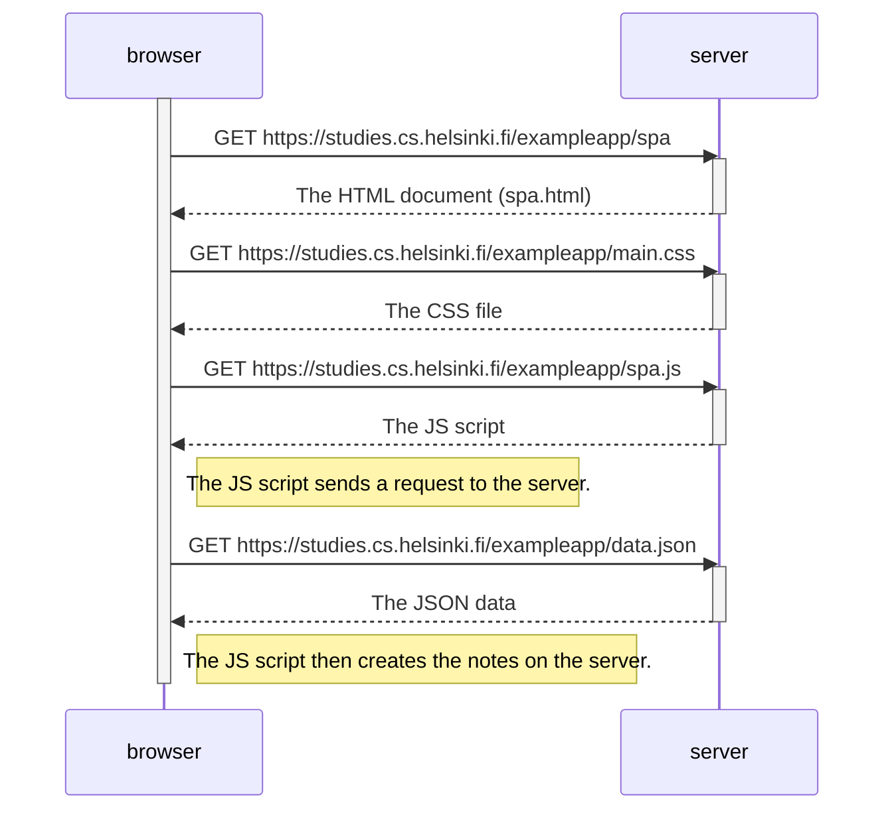

```mermaid
sequenceDiagram
    participant browser
    participant server

    activate browser

    browser->>server: GET https://studies.cs.helsinki.fi/exampleapp/spa
    activate server
    server-->>browser: The HTML document (spa.html)
    deactivate server

    browser->>server: GET https://studies.cs.helsinki.fi/exampleapp/main.css
    activate server
    server-->>browser: The CSS file
    deactivate server

    browser->>server: GET https://studies.cs.helsinki.fi/exampleapp/spa.js
    activate server
    server-->>browser: The JS script
    deactivate server

    note right of browser: The JS script sends a request to the server.
    browser->>server: GET https://studies.cs.helsinki.fi/exampleapp/data.json
    activate server
    server-->>browser: The JSON data
    deactivate server

    note right of browser: The JS script then creates the notes on the server.

    deactivate browser
```
